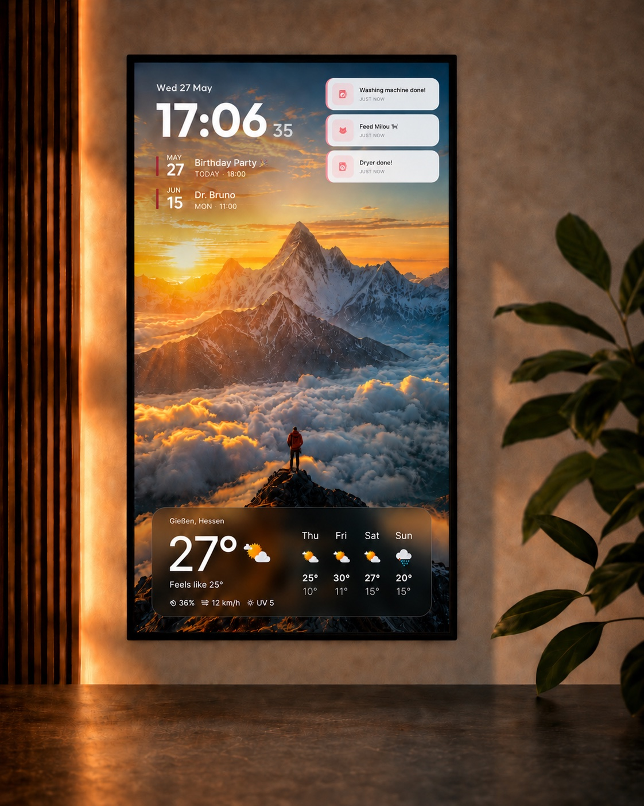
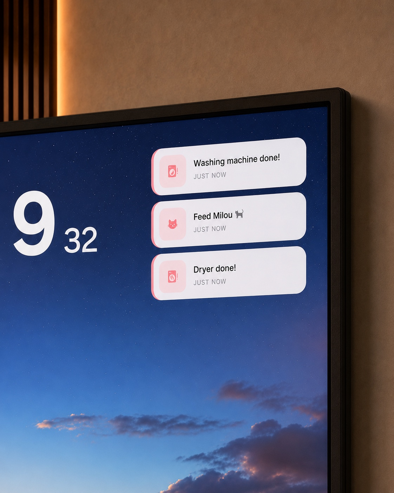

<div align="center">


**English** · [Deutsch](README.de.md)

Runs entirely on your home network — no cloud account, no domain needed.

Drag & drop editor · Real live updates · Smart-home · Calendar · Weather · Picture-frame mode

[](LICENSE.md)
[](https://nextjs.org/)
[](https://www.docker.com/)
[]()

</div>

---

## What's it for?

Magic Frame runs anywhere a browser lands on a display — and turns the
device into exactly what you need:

- **Family board** on the kitchen wall with shopping list, todos, calendar, and weather
- **Smart-home hub** on a tablet in the hallway with Home Assistant entities, scene buttons, and live notifications
- **Digital picture frame** on an old monitor with wallpaper rotation from Immich or WebDAV, subtle clock bottom-left
- **Status display** in the office with power usage, today's calendar, timers, and quick posts
- **Workshop or hobby monitor** with live HA data, scene buttons, weather
- **Living-room TV** in landscape as an ambient display between streams
- **Digital signage** for clubhouses, school hallways, libraries, community centers — rotating notices, schedules, weather, and quick-posts on any spare screen (non-commercial; see [license](LICENSE.md))

One "view" per display with its own layout, URL, and wallpaper source.
Multiple displays in parallel — everything syncs live via WebSocket,
no refresh needed.

---

## Where does it run?

**Magic Frame is a local app.** You install it once on a machine on
your home network — that machine sits there and becomes "the server".
Your tablets and monitors render dashboards by simply opening the
machine's local IP in a browser.

| Hardware | Works? |
|---|---|
| Raspberry Pi 4 / 5 | ✅ (Docker installable) |
| Synology / QNAP NAS | ✅ (Docker package in NAS OS) |
| Old laptop / desktop PC | ✅ |
| Mac mini / the Mac you're already working on | ✅ |
| Mini-PC (Beelink, Intel NUC, …) | ✅ |
| VPS / cloud server | ✅ (optional, only if reachable from outside) |

**No cloud account, no domain, no DDNS record required.** Tablets
just hit `http://192.168.x.x` on the home network. All the "hosting"
features below (Caddy with Let's-Encrypt HTTPS, DDNS updater, 2FA,
brute-force protection) are **all optional** and only relevant if you
want the dashboard reachable from outside.

> Rule of thumb: as long as you don't actively set up a domain,
> everything stays local on the LAN. Even Postgres lives inside the
> Docker container and needs no external DB.

---

## Quick Start

Two commands on a fresh Linux box. Skip step 1 if you already have Docker:

```bash
# 1. Install Docker (with Compose plugin) — official one-liner
curl -fsSL https://get.docker.com | sh

# 2. Install Magic Frame
curl -fsSL https://raw.githubusercontent.com/jeremiaa/magic-frame/main/deploy/install.sh | bash
```

> macOS / Windows? Install [Docker Desktop](https://www.docker.com/products/docker-desktop/) instead of step 1, then run step 2 in a terminal.

The second script

1. clones the repo
2. generates `SESSION_SECRET` automatically (uses `openssl` if available, falls back to `/dev/urandom`)
3. builds + starts the stack (app + Postgres + Caddy as reverse proxy)
4. waits until the app responds

Then open `http://<your-ip>` → **setup flow** → enter email + password
for the first admin → done. Optional integrations (Google/Microsoft
Calendar OAuth, OpenWeatherMap key, Todoist token) all get added later
through the UI.

Re-run on an existing install (idempotent — data + secrets stay):

```bash
cd magic-frame && ./deploy/install.sh
```

---

## Demo

### Editor — drag widgets onto the grid, configure in the inspector

<div align="center">
  
</div>

### Dashboard — all your views and live system status at a glance

<div align="center">
  
</div>

<sub><a href="public/demo/magic-frame-preview.mp4">Watch the full ~1 min walkthrough</a> (create view → drag widgets → configure inspector → save → live-sync to displays).</sub>

---

## In the wild

Real-world setups across different hardware. Same project, different layouts, different rooms.

### Big portrait monitor on the wall

<table>
<tr>
<td width="50%"></td>
<td width="50%"></td>
</tr>
<tr>
<td valign="top"><sub><strong>Info layout:</strong> clock, two upcoming calendar events, three live HA notifications, current temperature and 4-day weather forecast over a rotating Immich wallpaper. Quiet and glanceable for a hallway, office or bedroom wall.</sub></td>
<td valign="top"><sub><strong>Notifications close-up:</strong> rule-based tiles that auto-show when something happens (washing machine done, "feed Milou", dryer done) and auto-hide once acknowledged. Wallpaper keeps running underneath.</sub></td>
</tr>
</table>

### Picture-frame tablet on a side table

<p align="center"></p>

<p align="center"><sub><strong>Scene-button layout:</strong> a small tablet in a real photo-frame mount on the side table. Quick-access HA buttons (lights, "only good vibes", air purifier, …), small clock, current temperature, rotating wallpaper underneath.</sub></p>

---

## Screenshots

### Dashboard — entry point with live status
<div align="center">
  
</div>
<sub>3 stat cards (views · live-sync · integrations) + system-status strip (HTTPS, DDNS, HA, Todoist, modules, backups, security) + mini-previews of all views at a glance.</sub>

### Views — all dashboards & displays
<div align="center">
  
</div>
<sub>Each view is its own URL for one display — portrait for the tablet, landscape for the TV. Live previews show the real widget arrangement per view.</sub>

### What it looks like on the display

<table>
<tr>
<td width="33%"></td>
<td width="33%"></td>
<td width="33%"></td>
</tr>
<tr>
<td valign="top"><sub><strong>Smart-home display:</strong> clock, 4 scene/device buttons (HA services), weather with 4-day forecast.</sub></td>
<td valign="top"><sub><strong>Minimal / picture frame:</strong> just clock + weather, the wallpaper rotation in the background is the main element.</sub></td>
<td valign="top"><sub><strong>In action:</strong> tap on a button opens the matching pop-up — here a colour picker for a lamp incl. power toggle.</sub></td>
</tr>
</table>

<sub>Wallpapers rotate from Immich albums or a WebDAV folder. All widget cards have a soft blur backdrop (glassmorphism) layered over the photo backgrounds. Touch-optimised for iOS Safari without sticky-hover bugs.</sub>

### View editor — drag &amp; drop
<div align="center">
  
</div>
<sub>24-column grid, widget catalog on the left, inspector on the right. Auto-snapshot before every save, TV-sync to all connected displays.</sub>

### Modules — upload your own widgets
<div align="center">
  
</div>
<sub>10 core widgets installed. Custom modules via JS-bundle upload — hot-loading, no container restart needed.</sub>

---

## Features

### Editor & layouts
- **Drag & drop layout builder** on a 24-column grid, resize via handle
- **Multiple views** (portrait, landscape) — one URL per display
- **Live sync** via WebSockets — changes push instantly to every connected display
- **Auto snapshots** before every save (last 20), plus manual export/import
- **i18n** German + English fully translated

### Widgets (10 core)

| Widget | Description |
|---|---|
| **Clock** | Time + date, optional mini weather, 12/24h |
| **Weather** | Open-Meteo, DWD, OpenWeatherMap, or HA weather entity |
| **Calendar** | iCal feeds + Google + Microsoft 365 (OAuth) |
| **Home Assistant** | Any HA entity + rule engine (colour/icon per state) |
| **HA Notifications** | Rule-based push tiles, auto-hide when quiet |
| **Buttons** | Tap tiles with HA services / webhooks |
| **Timer** | Live countdown, startable via REST API / iOS Shortcut |
| **Messages** | Quick post (text + image) via REST API with TTL |
| **Shopping** | 3 sources: local, HA (todo.\*) or **Todoist** |
| **Todos** | 3 sources: local, HA (todo.\*) or **Todoist** |

### External integrations
- **Home Assistant** with live WebSocket entity updates
- **Google Calendar** and **Microsoft 365** via OAuth, multiple accounts in parallel
- **Todoist** with 1-click API-token setup
- **Immich** + **WebDAV** as wallpaper sources
- **OpenWeatherMap** as weather provider (optional)

### Hosting & security — *only if you want to be reachable from outside*
All of these are toggle-able in the UI. For **purely local LAN use**
you need none of them:

- **Caddy as reverse proxy** with automatic HTTPS via Let's Encrypt
- **10 DNS providers** baked into the image for ACME DNS-01
- **DDNS updater** with 3 provider modes (Cloudflare, Hetzner, DynDNS-v2 generic)
- **2FA (TOTP)** with authenticator apps + recovery codes
- **In-app brute-force protection** (fail2ban equivalent)
- **scrypt password hashing**, iron-session

### Custom modules — build your own widgets
- Upload a JS bundle, **hot-loading** without container rebuild
- Build helper: `node scripts/build-module.mjs <source>` → `module.json` + `bundle.js`
- Manifest with field schema (text/number/boolean/color/url/textarea)
- Example module in `examples/modules/hello/`
- Contributions to the core widget family are very welcome — see
  [`docs/module-development.md`](docs/module-development.md)

### Companion (iOS) — in development

Native Swift app being built in parallel with the web editor.
**Not yet available — TestFlight beta coming soon.** Planned features:

- **Timer** startable from the lock screen via App Intent
- **Quick post** (text + image) to individual displays with TTL
- **Shopping & todos** sync with iOS Reminders (two-way)
- **Push notifications** to individual frames
- **View switch / refresh** and live status from anywhere

Until the app ships (and afterwards too): all of this is already
available via the REST API with a shortcut token — perfect for
iOS Shortcuts, Tasker profiles, or curl scripts.

---

## Architecture

One Docker stack with three services, all on the same host:

| Layer | What |
|---|---|
| **Caddy** | Reverse proxy + automatic HTTPS (Let's Encrypt). Custom build with 10 DNS plugins for ACME DNS-01. Listens on 80/443, forwards to the app. For purely local operation Caddy runs as a simple HTTP proxy without TLS. |
| **Next.js app** | `/editor` is the admin UI. `/view/<id>` is what tablets/monitors render. `/api/...` is the REST surface for the companion app, shortcuts, and external tools. Socket.IO pushes live updates to every connected display — no refresh. |
| **Postgres 16** | Stores dashboards, widget layouts, snapshots, users, OAuth tokens (for calendar), custom modules as JS bundles, and all app settings. |

**Data flow on a layout save:**
Browser changes a widget → POST to Next.js API → snapshot to Postgres → Socket.IO event to all displays → every tablet re-renders the changed widget in under 100 ms.

**Persistent volumes:** Postgres data · editor settings · wallpaper cache · Caddyfile · ACME / Let's Encrypt certs. All survive container updates.

---

## Update / maintenance

### The normal way

```bash
cd magic-frame
./deploy/install.sh
```

Idempotent — pulls the latest code, rebuilds the containers, and leaves your `.env`, database volume and uploaded custom modules alone. From v1.0.2 onwards this works in one step even if upstream history got rewritten.

### If it fails (early v1.0.x clones)

If you cloned during the launch week (before v1.0.2) you may see one of these:

```
fatal: Need to specify how to reconcile divergent branches
```
```
! [rejected]    v1.0.0   -> v1.0.0   (would clobber existing tag)
```

That's because the upstream history was rewritten a few times during launch (Co-Author scrub, CLAUDE.md scrub, v1.0.1 retag). One-time recovery:

```bash
cd magic-frame
git fetch --force --tags origin
git reset --hard origin/main
./deploy/install.sh
```

Your `.env`, database and uploaded custom modules are untouched — none of that lives in git. After this one-time reset, regular `./deploy/install.sh` works on its own again.

### Database backup
```bash
docker compose exec db pg_dump -U postgres magicdashboard | gzip > backup-$(date +%F).sql.gz
```

### Logs
```bash
docker compose logs -f app
docker compose logs -f caddy
```

---

## Troubleshooting

### Browser refuses to load `http://<server-ip>` / says HTTPS failed
Brave, Chrome, and Edge auto-upgrade `http://` to `https://` by default. On a fresh local install there's no cert yet, so the upgrade fails before the request reaches Magic Frame.

- **Quickest workaround:** type the full path — `http://<server-ip>/login` (or `/editor`) instead of just `http://<server-ip>`. The auto-upgrade often only fires on bare host URLs.
- **Brave:** `brave://settings/security` → *"Always use secure connections"* → switch to *"Don't use"* (or set a per-site exception)
- **Chrome/Edge:** `chrome://settings/security` → *"Always use secure connections"* → off
- **Firefox/Safari:** usually fine with HTTP on local IPs out of the box
- **Long-term fix:** set up a domain → Caddy gets a real Let's-Encrypt cert automatically (see *Settings → Hosting & Network* in the app)

### `Bind for 0.0.0.0:80 failed: port is already allocated` during install
Something else on the host is already on port 80. Check with `ss -tlnp | grep :80` and `docker ps --filter "publish=80"`. Common culprits:

- `nginx` / `apache2` from the distro: `systemctl stop nginx && systemctl disable nginx`
- Another container holding the port: `docker stop <name>`
- After fixing, recreate the Caddy container cleanly: `docker compose down && docker compose up -d`

### Page still shows old behavior after `git pull` and rebuild
Both Next.js and your browser cache aggressively. Hard-refresh (`Cmd+Shift+R` / `Ctrl+Shift+R`) or open the URL in an incognito window after `docker compose up -d --build`.

---

## Documentation

| | |
|---|---|
| [`ROADMAP.md`](ROADMAP.md) | What's coming next + how releases work |
| [`LICENSE.md`](LICENSE.md) | Polyform Noncommercial 1.0.0 |
| [`.env.example`](.env.example) | All environment variables documented |
| [`docs/custom-modules.md`](docs/custom-modules.md) | Build + upload your own widget modules |
| [`docs/module-development.md`](docs/module-development.md) | Core-widget development (source-tree patch) |
| [`docs/companion-api.md`](docs/companion-api.md) | REST API endpoints (for the iOS companion or your own scripts) |

---

## Tech stack

Next.js 15 · React 19 · Postgres 16 + Prisma 7 · Caddy 2 (xcaddy custom build) ·
Tailwind CSS 4 · Socket.IO · react-grid-layout · iron-session · otplib · esbuild

---

## Contributions

Issues with a clear reproduction are especially welcome — they help me
move things forward directly. I'm happy to look at pull requests, but
depending on complexity it might take a bit.

For larger changes: please open an issue first so we can sort out what
fits and what doesn't.

---

## License

**[Polyform Noncommercial 1.0.0](LICENSE.md)** — open-source-style,
allows free use, modification, distribution, and contribution.
Commercial use (selling, SaaS offering, embedding in your own products)
is not permitted without a separate license.

For commercial inquiries: **magicframeapp@gmail.com**

<sub>Vibe-coded with Claude.</sub>
